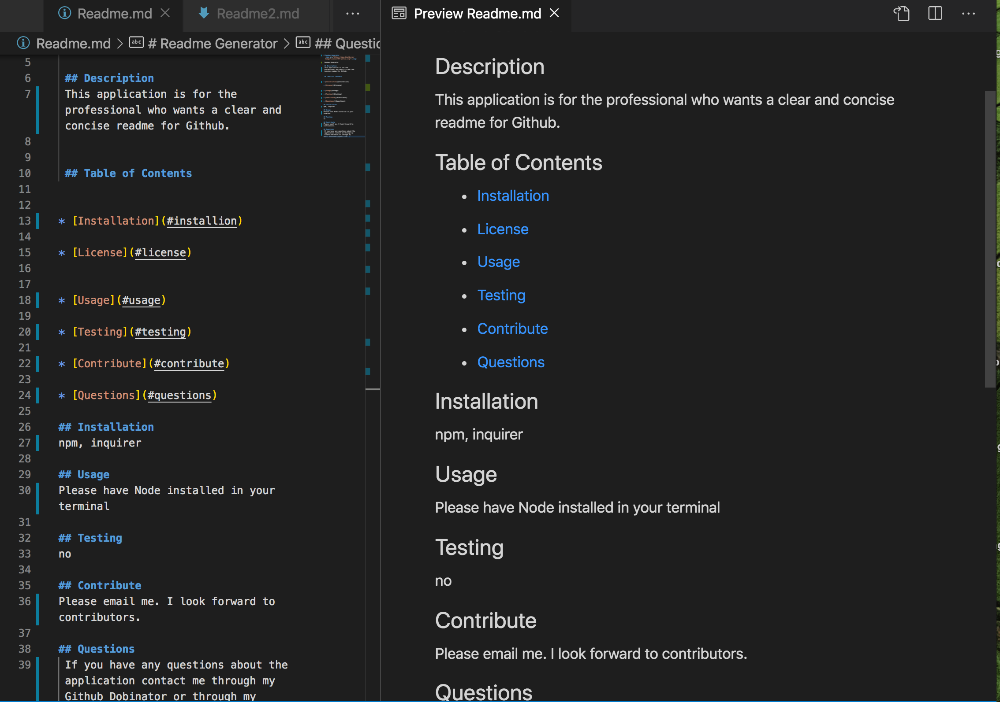

# Readme Generator

## Overview:
   This application was created to assist with the creation of a dynamically generated professional README.md. The application will create license buttons that will be displayed on your Github page. It will have a detailed listing with the table of contents and infomation on how to contact and contribute if so desired.

## Index

* Installation
* Built with
* Testing
* Contribute
* Questions

## Installation
   This application will be invoked with the following command 'node index.js'. 

## Built with:
- JavaScript
- Inquirer

## Testing
n/a

## Contribute/ Questions:
   If you are interested in contributing with this application please contact me through email. My github user name is Dobinator and my email is dobsonemily@gmail.com.

 ### Video presentation of the application.

 https://youtu.be/PNDij0bQMeM

 
### Still of application
 

  